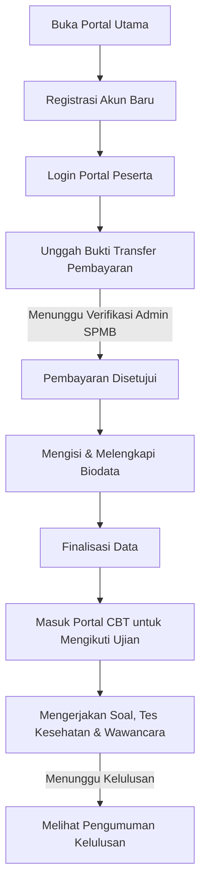

# 🎓 Sistem Informasi Seleksi Penerimaan Mahasiswa Baru (SPMB) & CBT - Universitas Hang Tuah Pekanbaru (UHTP)

Repositori ini berisi sistem informasi terintegrasi untuk **Seleksi Penerimaan Mahasiswa Baru (SPMB)** dan **Computer Based Test (CBT)** pada **Universitas Hang Tuah Pekanbaru (UHTP)**. Aplikasi ini dirancang untuk memudahkan calon mahasiswa baru dalam melakukan registrasi, konfirmasi pembayaran, pengisian biodata, pengerjaan ujian masuk online, hingga melihat pengumuman kelulusan. Sistem ini juga menyediakan dashboard administrasi lengkap untuk verifikator SPMB dan pengelola CBT.

---

## 🛠️ Tech Stack & Arsitektur Sistem

Aplikasi ini menggunakan arsitektur **decoupled** (terpisah) antara Frontend dan Backend dengan rincian teknologi sebagai berikut:

* **Backend API**: 
  - **Laravel 12** (PHP >= 8.2)
  - **Laravel Sanctum** untuk Otentikasi Token API
  - **MySQL Database** untuk penyimpanan data relasional
* **Frontend Portal Utama (Root)**: 
  - **React 19** + **TypeScript** + **Vite 7**
  - **Tailwind CSS v4** untuk styling responsif modern
  - Rich Text Editors (CKEditor 5, TinyMCE, Jodit) untuk manajemen soal ujian
* **Frontend Landing Page (Sub-folder)**:
  - **React** + **TypeScript** + **Vite**
  - Digunakan khusus sebagai halaman promosi & informasi brosur pendaftaran luar

---

## 📁 Struktur Direktori Proyek

```bash
spmb-landing/
├── backend/              # Aplikasi Backend (Laravel 12 API)
├── landing-page/         # Aplikasi Frontend Landing Page Informasi (React)
├── src/                  # Kode Sumber Frontend Portal Utama & CBT (React + TS)
│   ├── components/       # Komponen UI Reusable
│   ├── data/             # Data Statis & Wilayah (kabupaten)
│   ├── AdminDashboard.tsx# Dashboard Admin Verifikasi SPMB
│   ├── CbtAdminDashboard.tsx # Dashboard Admin CBT (Soal & Kelulusan)
│   ├── CbtPortal.tsx     # Gerbang Portal Ujian CBT
│   ├── UserDashboard.tsx # Dashboard Calon Mahasiswa Baru
│   └── App.tsx           # Entry Point Aplikasi & Handler Autentikasi
├── package.json          # Package Configuration Frontend Root
└── README.md             # Dokumentasi Sistem (File Ini)
```

---

## ⚙️ Persyaratan Sistem (Prerequisites)

Sebelum menjalankan aplikasi di komputer lokal Anda, pastikan telah menginstal:
1. **PHP >= 8.2**
2. **Composer** (Dependency Manager untuk PHP)
3. **Node.js >= 18** (dan npm)
4. **MySQL Database Server** (XAMPP / Laragon / MySQL Workbench)

---

## 🚀 Panduan Instalasi & Setup Lokal

Ikuti langkah-langkah di bawah ini secara berurutan untuk memasang dan menjalankan sistem di komputer lokal Anda:

### Langkah 1: Setup Database MySQL
1. Buka aplikasi database manager Anda (seperti phpMyAdmin pada XAMPP).
2. Buat sebuah database baru dengan nama **`spmb_db`**.

### Langkah 2: Setup Backend (Laravel API)
1. Buka terminal atau CMD, lalu arahkan ke direktori `backend/`:
   ```bash
   cd backend
   ```
2. Salin file konfigurasi environment dari `.env.example` ke `.env`:
   ```bash
   copy .env.example .env
   ```
3. Sesuaikan konfigurasi database pada file `.env` jika diperlukan (Secara default sudah teratur untuk MySQL local dengan username `root` tanpa password):
   ```env
   DB_CONNECTION=mysql
   DB_HOST=127.0.0.1
   DB_PORT=3306
   DB_DATABASE=spmb_db
   DB_USERNAME=root
   DB_PASSWORD=
   ```
4. Instal dependensi PHP menggunakan Composer:
   ```bash
   composer install
   ```
5. Buat Application Key baru:
   ```bash
   php artisan key:generate
   ```
6. Jalankan migrasi database untuk membuat tabel:
   ```bash
   php artisan migrate
   ```
7. Masukkan data master awal (program studi, gelombang pendaftaran, formulir, dll.) melalui seeder:
   ```bash
   php artisan db:seed --class=MasterDataSeeder
   ```
8. Jalankan server lokal backend (Secara default akan berjalan di `http://127.0.0.1:8000`):
   ```bash
   php artisan serve
   ```

---

### Langkah 3: Setup Frontend Portal Utama (Root)
Portal ini memuat halaman pendaftaran, dashboard calon mahasiswa, serta dashboard admin utama.
1. Buka terminal baru dan pastikan Anda berada di direktori **root** proyek (`spmb-landing/`):
   ```bash
   # Jika sebelumnya di folder backend:
   cd ..
   ```
2. Instal semua package dependensi npm:
   ```bash
   npm install
   ```
3. Jalankan development server untuk frontend portal utama (biasanya berjalan di `http://localhost:5173`):
   ```bash
   npm run dev
   ```

---

### Langkah 4: Setup Landing Page Informasi (Optional)
Halaman depan promosi yang berisi brosur-brosur informasi SPMB.
1. Buka terminal baru dan masuk ke folder `landing-page/`:
   ```bash
   cd landing-page
   ```
2. Instal semua dependensi npm:
   ```bash
   npm install
   ```
3. Jalankan development server khusus landing page (biasanya berjalan di `http://localhost:5174`):
   ```bash
   npm run dev
   ```

---

## 🔑 Kredensial Akun Default (Untuk Pengujian)

Untuk mempermudah pengujian alur sistem tanpa harus mendaftar dari awal, Anda dapat masuk menggunakan akun default berikut pada halaman login portal utama:

| Peran (Role) | Email / Username | Password | Deskripsi / Fungsi Utama |
| :--- | :--- | :--- | :--- |
| **Admin SPMB Utama** | `admin@uhtp.ac.id`<br>atau `admin@spmb.com`<br>atau `admin123` | `admin123` | Memverifikasi pembayaran, menyetujui biodata pendaftar, monitoring statistik, dan mereset password peserta. |
| **Admin CBT & Soal** | `admincbt@uhtp.ac.id` | `admincbt123` | Mengelola bank soal ujian, jadwal tes, melihat jawaban kesehatan/wawancara, serta menentukan status kelulusan. |
| **Calon Mahasiswa (Jalur Cepat)** | `student@uhtp.ac.id` | `student123` | Akun simulasi mahasiswa pendaftar atas nama **Lukman Hakim** yang sudah terisi datanya untuk mempermudah demo. |

---

## 🔄 Tata Cara Masuk & Alur Kerja Sistem (End-to-End User Flow)

Berikut adalah panduan lengkap alur operasional sistem dari sisi calon mahasiswa baru hingga proses kelulusan oleh admin:

### 🧑‍🎓 A. Alur Kerja Calon Mahasiswa Baru (Pendaftar)



1. **Registrasi Akun**:
   - Buka portal utama (`http://localhost:5173`).
   - Klik **Daftar Akun** pada bagian tengah portal.
   - Isi formulir registrasi dengan lengkap (Nama Lengkap, NIK 16 digit, Email, No. HP, Pilihan Program Studi, Gelombang Pendaftaran, dan Password).
   - Masukkan kode keamanan (CAPTCHA) dengan benar, lalu klik **Daftar Sekarang**.

2. **Login Portal**:
   - Klik **Masuk Portal** di halaman utama.
   - Masukkan Email dan Password yang telah Anda buat saat registrasi, lalu klik **Masuk**.

3. **Konfirmasi Pembayaran**:
   - Setelah masuk ke dashboard peserta, Anda akan diarahkan untuk membayar biaya pendaftaran ke rekening kampus yang tertera.
   - Buka menu **Konfirmasi Pembayaran**, masukkan nama bank pengirim, nama pemilik rekening, nominal transfer, serta unggah bukti transfer (foto/PDF).
   - Kirim konfirmasi pembayaran. Status akun Anda akan berubah menjadi **Pending** menunggu verifikasi admin.

4. **Pengisian Biodata**:
   - Setelah status pembayaran Anda diubah menjadi **Verified** oleh Admin, menu pengisian biodata akan otomatis terbuka.
   - Isi formulir biodata yang terbagi dalam beberapa tab (Data Diri, Alamat Lengkap, Data Orang Tua/Wali, Data Sekolah Asal, dan Pilihan Program Studi Kedua).
   - Unggah berkas persyaratan pendukung (seperti foto formal, ijazah/kartu keluarga).
   - Klik **Finalisasi Data** di bagian bawah form untuk mengunci data Anda.

5. **Mengikuti Ujian Masuk (CBT)**:
   - Setelah biodata terfinalisasi dan divalidasi, tombol **Masuk Portal CBT** di dashboard akan aktif.
   - Masuk ke portal CBT, di sini Anda wajib mengerjakan:
     - **Tes Akademik/Soal Ujian**: Mengerjakan paket soal pilihan ganda sesuai waktu ujian yang dijadwalkan.
     - **Tes Kesehatan**: Menjawab pertanyaan skrining kesehatan secara jujur.
     - **Wawancara**: Mengisi tanggapan wawancara tertulis/unggah berkas wawancara.

6. **Melihat Pengumuman Kelulusan**:
   - Jika admin telah menilai hasil ujian dan menentukan kelulusan, Anda dapat melihat status akhir kelulusan (LULUS / TIDAK LULUS) beserta link berkas pengumuman kelulusan di dashboard portal peserta Anda.

---

### 💻 B. Alur Kerja Administrator SPMB (Verifikator Keuangan & Berkas)

1. **Login Admin**:
   - Buka halaman login admin di portal dengan mengeklik tombol login admin khusus atau langsung memasukkan kredensial admin (`admin@uhtp.ac.id` / `admin123`).
2. **Verifikasi Pembayaran**:
   - Masuk ke menu **Verifikasi Pembayaran**.
   - Tinjau bukti transfer yang diunggah oleh pendaftar. Jika valid, klik tombol **Approve** (Ubah status ke Verified) untuk membuka akses biodata peserta. Jika tidak valid, pilih **Reject**.
3. **Verifikasi Berkas Biodata**:
   - Pergi ke menu **Verifikasi Biodata** untuk meninjau data diri dan dokumen pendukung yang diunggah oleh pendaftar yang sudah melakukan finalisasi.
   - Jika berkas lengkap dan sesuai kriteria, klik verifikasi berkas agar peserta bisa melanjutkan ke tahap ujian CBT.
4. **Reset Password Peserta**:
   - Jika ada peserta yang lupa password-nya, admin SPMB dapat masuk ke menu **Daftar Peserta** lalu mengeklik tombol **Reset Password** untuk mengembalikannya ke password default kampus (`uhtp12345`).

---

### 🖥️ C. Alur Kerja Administrator CBT (Pengelola Ujian & Nilai)

1. **Login Admin CBT**:
   - Masuk menggunakan akun admin CBT (`admincbt@uhtp.ac.id` / `admincbt123`).
2. **Manajemen Bank Soal**:
   - Masuk ke menu **Manajemen Soal**.
   - Admin dapat menambah, mengedit, atau menonaktifkan soal-soal pilihan ganda yang akan diujikan kepada peserta. Editor soal mendukung fitur rich text (Jodit/CKEditor) untuk menyertakan gambar atau rumus.
3. **Mengatur Jadwal Ujian**:
   - Gunakan menu **Jadwal Ujian** untuk mengatur periode waktu kapan ujian CBT dapat diakses oleh calon mahasiswa baru.
4. **Verifikasi Kesehatan & Jawaban Wawancara**:
   - Admin CBT meninjau hasil jawaban tes kesehatan dan wawancara peserta di menu **Hasil Seleksi Kesehatan & Wawancara**.
   - Isi skor penilaian kesehatan dan wawancara.
5. **Penentuan Kelulusan**:
   - Pada halaman rekapitulasi nilai akhir, admin CBT dapat melihat hasil nilai pengerjaan CBT akademik ditambah dengan skor kesehatan dan wawancara.
   - Klik tombol **Update Status Kelulusan** untuk menentukan apakah peserta tersebut **LULUS** atau **TIDAK LULUS** ke program studi pilihan mereka di Universitas Hang Tuah Pekanbaru.

---

## 📞 Hubungan & Kontak

Jika terdapat kendala teknis atau pertanyaan mengenai instalasi sistem ini, Anda dapat menghubungi tim pengembang atau administrator jaringan UHTP.

**Universitas Hang Tuah Pekanbaru**  
📍 Jl. Zainal Abidin No. 23, Pekanbaru, Riau  
🌐 Website Utama: [https://uhtp.ac.id](https://uhtp.ac.id)
